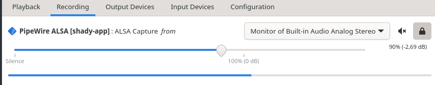

# Shady

Shady is a lib to add a [shadertoy]-like effect to your applications.

Its main application is ([shady-app]) to create [shadertoy]-like shaders but with [wgsl] if you want to try it yourself.

# Usage

In general `shady-app <path> --template` will likely be what you want to execute.

## `nix`

If you are using `nix` with flakes: Simply run `nix run github:TornaxO7/shady -- <path to shader> --template` and you are good to go.

## Build it on your own

You need to install [rust] opengl/vulkan and then you can run:

```bash
cargo run --release -- <path> --template
```

# Features

- Live reloading
- Audio visualisation

# Demo

A demo can be seen [here](https://filebrowser.tornaxo7.de/api/public/dl/LB5bVE74?inline=true).

# Examples

- The template itself is an example if you run `shady <path> --template`
- See in `shader-examples/`

# Troubleshooting

## `shady` audio doesn't listen to my systems audio

Currently `shady` is listening to your default output device.
Take a look into your settings (for example with [pavucontrol], under "Recording") if shady is listening to the correct source.
For example on my system it looks like this (after starting [pavucontrol]):



# Status

You are able to write shaders similar to [shadertoy] and you have the uniform values `iTime` and `iResolution` but also `iAudio` if you want to create something with music visualisation.
However it's mostly unstable and unpolished (for example [gamma correction] is missing), that's why I'm not creating a release (yet?) for the lib but also for the app.

[shadertoy]: https://www.shadertoy.com/
[shady-app]: https://github.com/TornaxO7/shady/tree/main/shady-app
[wgsl]: https://www.w3.org/TR/WGSL/
[pavucontrol]: https://github.com/pulseaudio/pavucontrol
[gamma correction]: https://en.wikipedia.org/wiki/Gamma_correction
[rust]: https://www.rust-lang.org/
